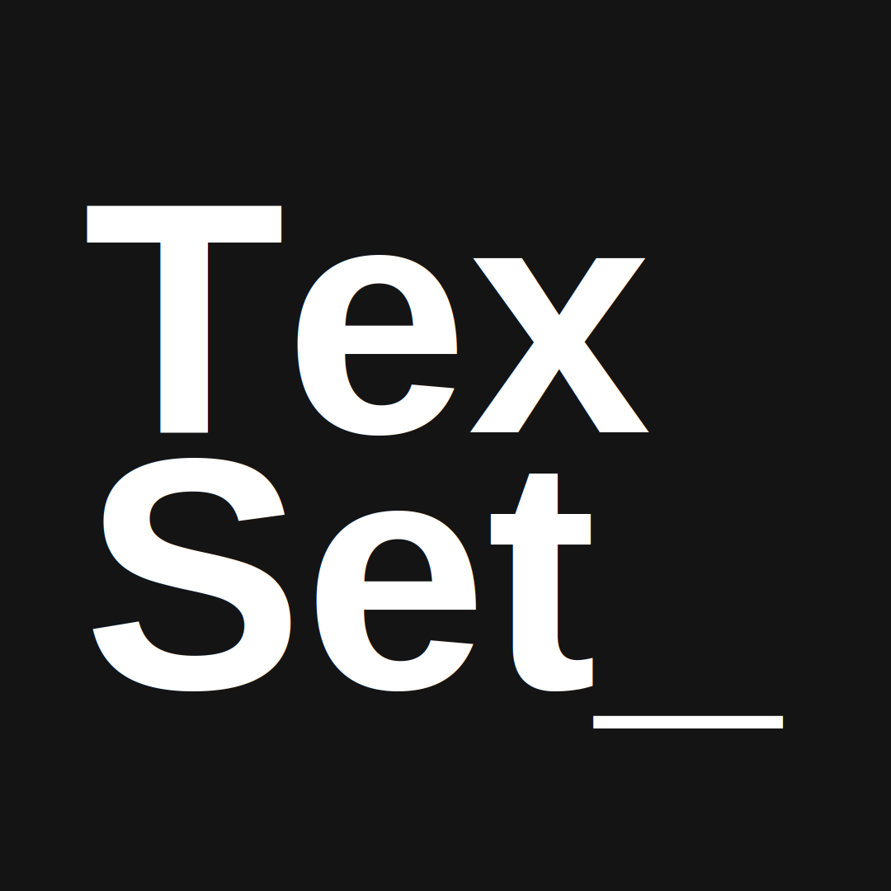

<div align="center">
  
  <h1>TexSet</h1>
  <p>A fast, local-first LaTeX editor that runs in your browser.</p>
</div>

TexSet is an Overleaf-style editor you run yourself. Write LaTeX on the left,
watch the PDF build on the right. Everything happens on your machine: no
accounts, no external APIs, no cloud. Your documents are just files in a folder
you control.

It's built to be modular. Today it compiles LaTeX with xelatex; the editor and
compiler are wired through an engine abstraction so Typst support can drop in
later without reworking the app. The accent color even follows the document type
(green for LaTeX) so you always know what you're editing.

> **Status:** active development. The foundation is in place and features are
> landing branch by branch.

## Running it

The quickest way is Docker, which bundles Node and a TeX Live install so you
don't have to set up a LaTeX toolchain yourself.

```bash
git clone https://github.com/texset/texset.git
cd texset
docker compose up --build
```

Then open http://localhost:7474. Your projects appear in `./projects` on your
machine.

See [docs/SELF_HOSTING.md](docs/SELF_HOSTING.md) for configuration and other
deployment notes.

## Local development

You'll need Node.js 20+, pnpm, and a working `xelatex` on your `PATH`.

```bash
pnpm install
pnpm dev
```

The dev server runs on http://localhost:7474. There's also a Docker dev setup
with hot reload that includes TeX Live, if you'd rather not install it locally:

```bash
docker compose -f docker-compose.dev.yml up
```

## How it's built

| Layer       | Choice                          |
| ----------- | ------------------------------- |
| Framework   | Next.js 14 (App Router)         |
| Language    | TypeScript, strict mode         |
| Styling     | Tailwind CSS v3                 |
| Editor      | CodeMirror 6                    |
| PDF viewer  | pdf.js                          |
| Index       | SQLite (better-sqlite3)         |
| TeX engine  | xelatex (TeX Live)              |
| Container   | Docker, node:20-bookworm-slim   |

More detail in [docs/ARCHITECTURE.md](docs/ARCHITECTURE.md).

## Contributing

Contributions are welcome. Start with [docs/CONTRIBUTING.md](docs/CONTRIBUTING.md)
for the branching and pull request workflow.

## License

[MIT](LICENSE)
